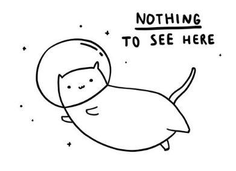

<h1 align="center">
   🥋 Brazillian Jiu-Jitsu Technique Tracker
</h1>

<h4 align="center">
    BJJ Technique Learning Web Application focuses on tracking techniques for user to view, add, edit, delete as per their account
</h4>

<!-- Improved compatibility of back to top link: See: https://github.com/brendantwz/simplypress-blogpost/pull/73 -->

<!--
*** Thanks for checking out the Best-README-Template. If you have a suggestion
*** that would make this better, please fork the repo and create a pull request
*** or simply open an issue with the tag "enhancement".
*** Don't forget to give the project a star!
*** Thanks again! Now go create something AMAZING! :D
-->

<!-- PROJECT LOGO -->
 

  <a href="https://github.com/brendantwz/jiu-jitsu-technique-tracker">
    <kbd></kbd>
  </a>

  

      <!-- PROJECT SHIELDS -->
<!--
*** I'm using markdown "reference style" links for readability.
*** Reference links are enclosed in brackets [ ] instead of parentheses ( ).
*** See the bottom of this document for the declaration of the reference variables
*** for contributors-url, forks-url, etc. This is an optional, concise syntax you may use.
*** https://www.markdownguide.org/basic-syntax/#reference-style-links
-->

[![Contributors][contributors-shield]][contributors-url]
[![Forks][forks-shield]][forks-url]
[![Stargazers][stars-shield]][stars-url]
[![Issues][issues-shield]][issues-url]
[![MIT License][license-shield]][license-url]
[![LinkedIn][linkedin-shield]][linkedin-url]
     
     
    <a href="https://github.com/brendantwz/jiu-jitsu-technique-tracker/issues">Report Bug</a>
    ·
    <a href="https://github.com/brendantwz/jiu-jitsu-technique-tracker/issues">Request Feature</a>
      
  

<!-- ABOUT THE PROJECT -->
## About The Project :brain:

<h3>Why this project?</h3>
I am tired of browsing through my <b>saved reels or youtube video</b> for grappling content. So, why not create my own tracking libraries for me to keep track of my grappling progress? 🤔 
 
So, that is my sole inspiration. Project is still <b>on-going with several road blocks and fixing terrible planning</b>  
 
p.s: its my first major CRUD project with login authorization. Please be kind 🥺  

 
If you find this helpful or can resonate with that kind of struggle as a fellow grappler/coder and would love to contribute or work with it and feel free to do so! (maybe a star too ⭐)

(<a href="#readme-top">back to top</a>)

### Built With :hammer_and_wrench:
* Javascript
* <a href="https://expressjs.com/">Express.js</a> - backend framework for node.js
* <a href="https://nodejs.org/en">Node.js</a> - Javascript runtime environment
* <a href="https://tailwindui.com/">Tailwind UI</a> - CSS framework that is has a set of responsive front-end template
* <a href="https://www.mongodb.com/try/download/community">MongoDB</a> -  NoSQL Database
* <a href="https://www.postman.com/">Postman</a> - RESTful API Testing

(<a href="#readme-top">back to top</a>)

<!-- GETTING STARTED -->
## Getting Started :new:

If you want to play around with this project locally.
To get a local copy up and running follow these simple example steps.

### TODO - Prerequisites :eyes:

* Make sure you have Node.js installed on your local system

### TODO - Installation :computer:

(<a href="#readme-top">back to top</a>)

<!-- USAGE EXAMPLES -->
## TODO - Usage :space_invader:

(<a href="#readme-top">back to top</a>)

<!-- CONTRIBUTING -->
## Contributing :gift:

Contributions are what make the open source community such an amazing place to learn, inspire, and create. Any contributions you make are **greatly appreciated**.

If you have a suggestion that would make this better, please fork the repo and create a pull request. You can also simply open an issue with the tag "enhancement".
Don't forget to give the project a star! Thanks again!

1. Fork the Project
2. Create your Feature Branch (`git checkout -b feature/AmazingFeature`)
3. Commit your Changes (`git commit -m 'Add some AmazingFeature'`)
4. Push to the Branch (`git push origin feature/AmazingFeature`)
5. Open a Pull Request

(<a href="#readme-top">back to top</a>)

<!-- LICENSE -->
## License :clipboard:

Distributed under the MIT License. See `LICENSE.txt` for more information.

(<a href="#readme-top">back to top</a>)

<!-- CONTACT -->
## Contact :iphone:

My LinkedIn - [@brendantwz](https://linkedin.com/in/brendantwz)

Project Link: [https://github.com/brendantwz/jiu-jitsu-technique-tracker](https://github.com/brendantwz/jiu-jitsu-technique-tracker)

(<a href="#readme-top">back to top</a>)

<!-- ACKNOWLEDGMENTS -->
## Acknowledgments :muscle:

Use this space to list resources you find helpful and would like to give credit to. I've included a few of my favorites to kick things off!

* [MIT License](https://choosealicense.com/licenses/mit/)
* [Emoji Mart by missive](https://github-emoji-picker.rickstaa.dev/)
* [Img Shields](https://shields.io)
* [GitHub Pages](https://pages.github.com)
* [Readme Template](https://github.com/twanmulder/github-readme-templates)

(<a href="#readme-top">back to top</a>)

<!-- MARKDOWN LINKS & IMAGES -->
<!-- https://www.markdownguide.org/basic-syntax/#reference-style-links -->
[contributors-shield]: https://img.shields.io/github/contributors/brendantwz/jiu-jitsu-technique-tracker.svg?style=for-the-badge
[contributors-url]: https://github.com/brendantwz/jiu-jitsu-technique-tracker/graphs/contributors
[forks-shield]: https://img.shields.io/github/forks/brendantwz/jiu-jitsu-technique-tracker.svg?style=for-the-badge
[forks-url]: https://github.com/brendantwz/jiu-jitsu-technique-tracker/network/members
[stars-shield]: https://img.shields.io/github/stars/brendantwz/jiu-jitsu-technique-tracker.svg?style=for-the-badge
[stars-url]: https://github.com/brendantwz/jiu-jitsu-technique-tracker/stargazers
[issues-shield]: https://img.shields.io/github/issues/brendantwz/jiu-jitsu-technique-tracker.svg?style=for-the-badge
[issues-url]: https://github.com/brendantwz/jiu-jitsu-technique-tracker/issues
[license-shield]: https://img.shields.io/github/license/brendantwz/jiu-jitsu-technique-tracker.svg?style=for-the-badge
[license-url]: https://github.com/brendantwz/jiu-jitsu-technique-tracker/blob/master/LICENSE.txt
[linkedin-shield]: https://img.shields.io/badge/-LinkedIn-black.svg?style=for-the-badge&logo=linkedin&colorB=555
[linkedin-url]: https://linkedin.com/in/brendantwz